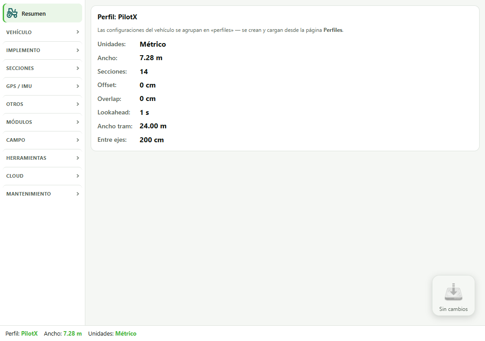
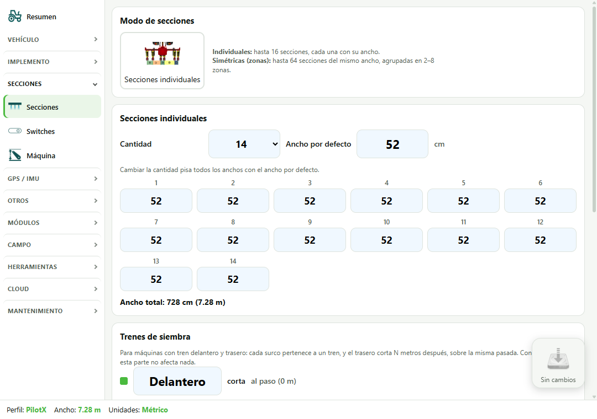
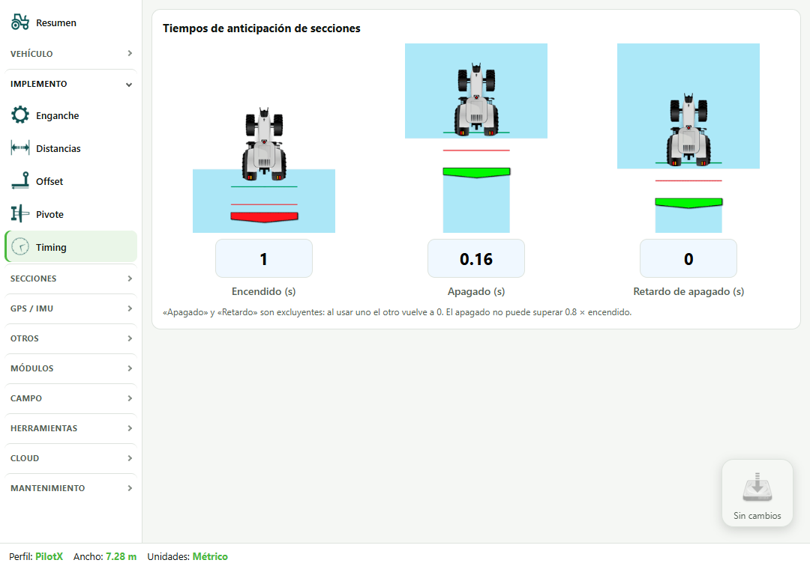
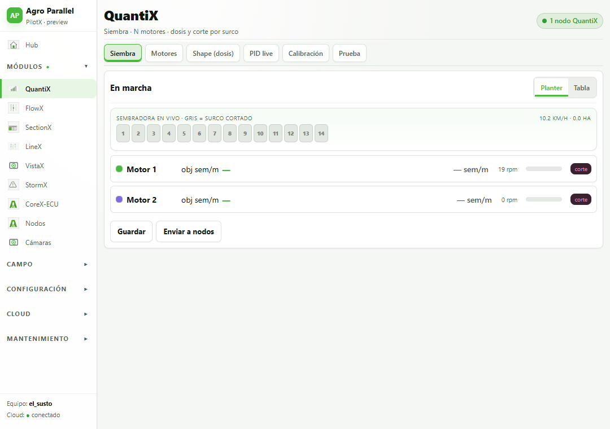
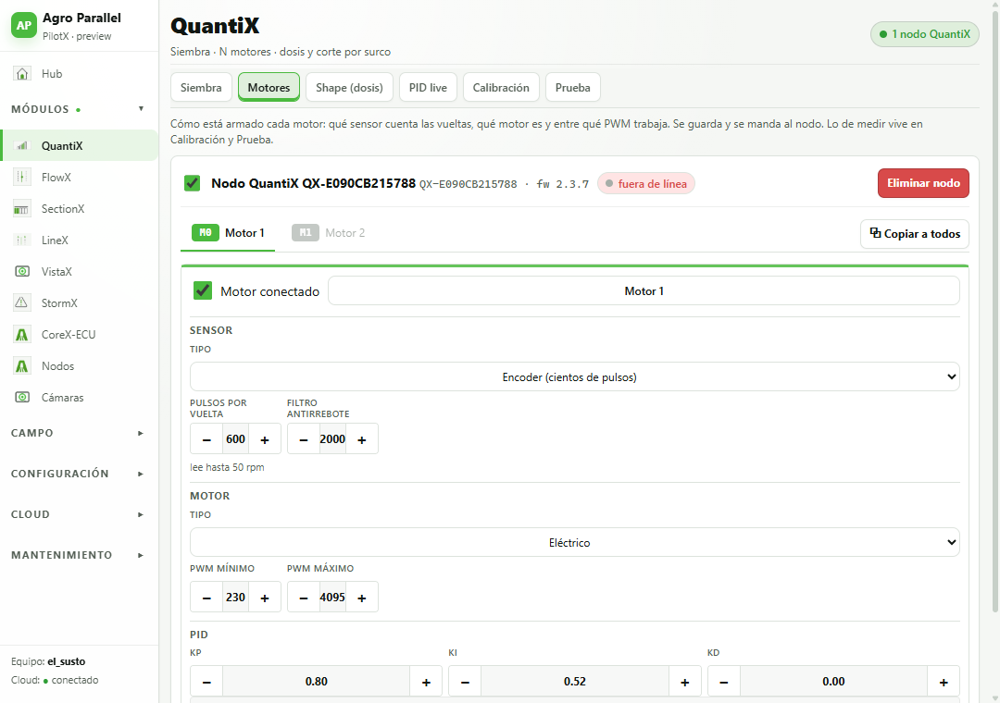
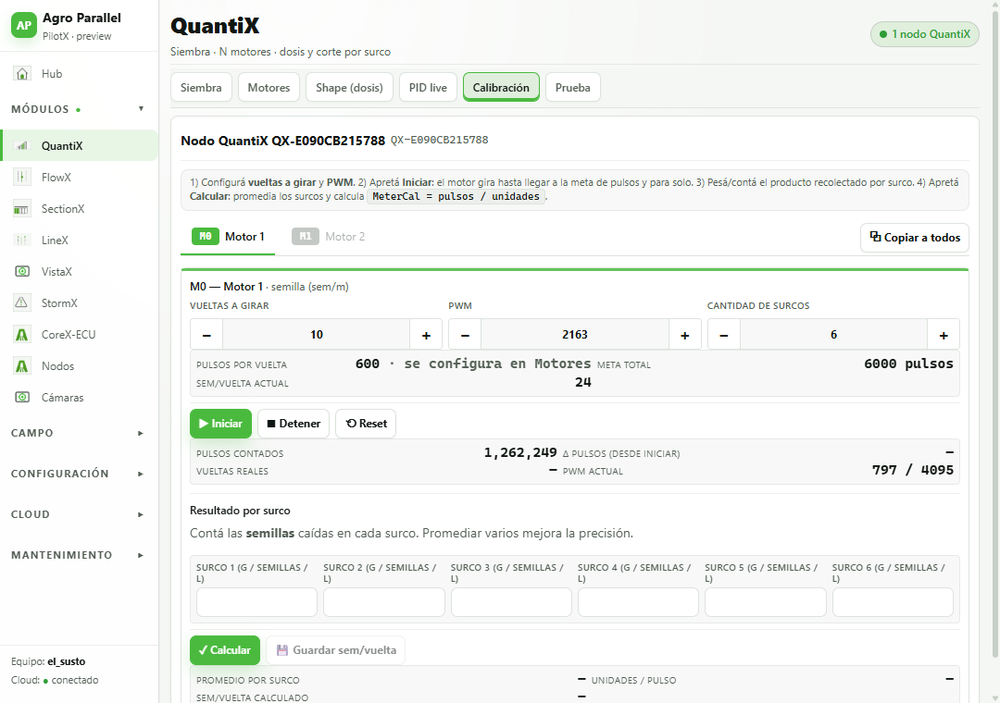
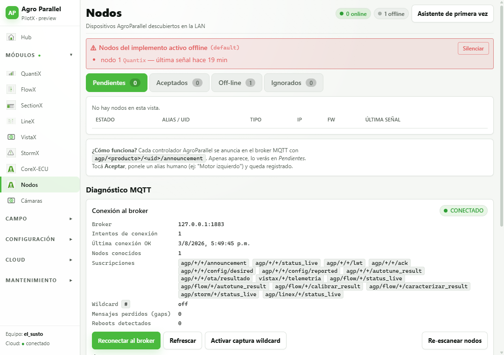
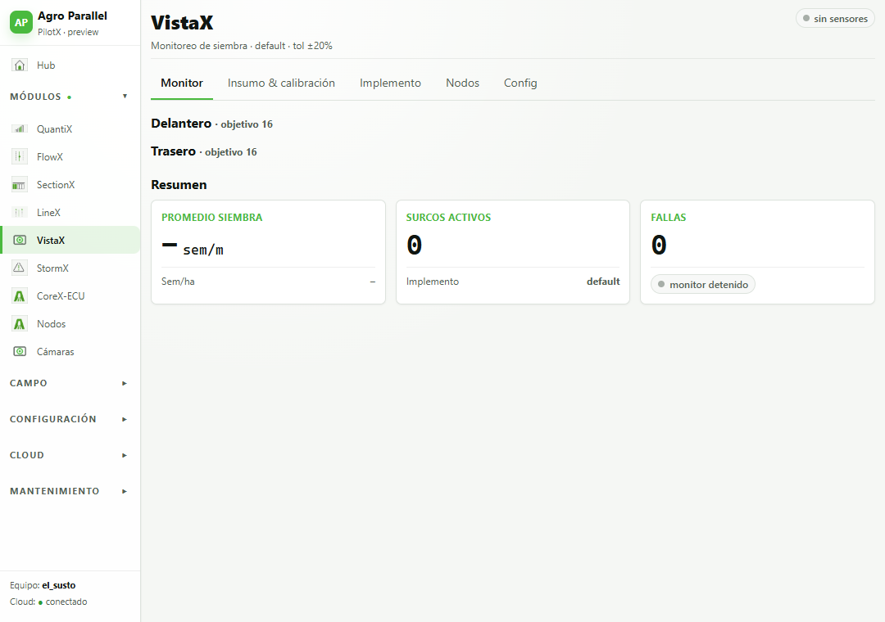
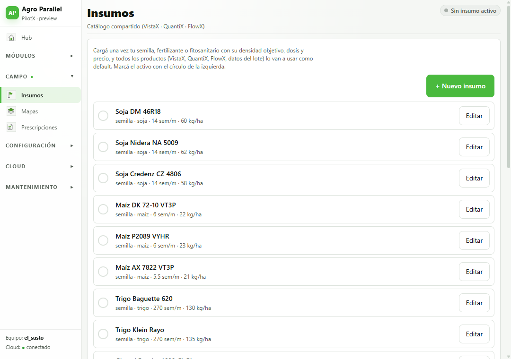
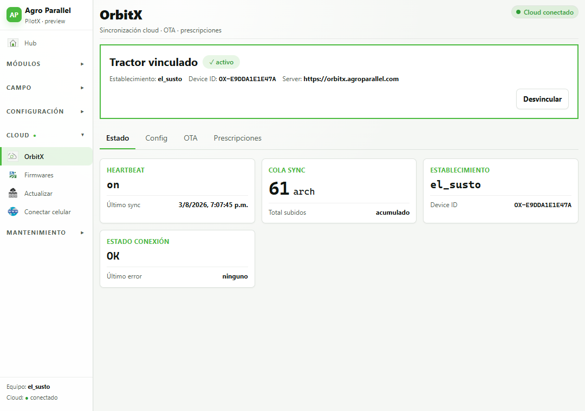

# Manual de PilotX

Guía de las pantallas de PilotX, pensada para quien configura el equipo antes de
salir al lote y para quien lo opera desde la cabina.

Las capturas son de la versión que está corriendo hoy. Si una pantalla se ve
distinta a la de este manual, mandá una captura: probablemente el manual quedó
viejo.

---

## 1. Cómo está organizado

PilotX tiene dos partes:

- **La pantalla de cabina** (el mapa, las barras de guiado, los botones de
  sección). Es lo que se usa trabajando.
- **La Configuración**, que es donde se ajusta todo lo demás. Se abre con el
  engranaje y funciona como un menú en acordeón: se ven los títulos de los
  grupos y se despliega el que se toca.

Los grupos del menú de Configuración:

| Grupo | Para qué |
|---|---|
| **Vehículo** | Tipo y marca, dimensiones, posición de la antena |
| **Implemento** | Enganche, distancias, offset, pivote y **Timing** |
| **Secciones** | Cantidad y ancho de secciones, switches, módulo de máquina |
| **GPS / IMU** | Fuente de rumbo y de rolido |
| **Otros** | U-Turn, Tram, Sonidos |
| **Módulos** | QuantiX, VistaX, FlowX, SectionX, LineX, StormX, Nodos, Cámaras |
| **Campo** | Insumos, Mapas, Prescripciones |
| **Herramientas** | Calculadora de siembra, Lab PID, Diagnóstico PWM |
| **Cloud** | OrbitX, Firmwares, Actualizar, Conectar celular |
| **Mantenimiento** | WiFi de Windows, Sistema, Eventos, Debug |

> **Teclado**: al tocar cualquier campo se abre un teclado en pantalla, en su
> propia ventana. Se puede arrastrar de la barra de arriba a donde no moleste, y
> el botón ⇩ lo devuelve abajo.

---

## 2. Resumen

La primera pantalla de Configuración. Muestra de un vistazo el perfil cargado y
los números que definen el trabajo: ancho, cantidad de secciones, offset,
overlap, lookahead, ancho de tramline y distancia entre ejes.

Sirve para confirmar, antes de arrancar, que el equipo está con el perfil
correcto. Si el ancho o las secciones no son los de la máquina que está
enganchada, todo lo demás va a estar mal.

Las configuraciones del vehículo se agrupan en **perfiles**: se crean y se
cargan desde la página Perfiles.

---

## 3. Secciones

Define en cuántos pedazos se corta el implemento y cuánto mide cada uno.

- **Modo de secciones**
  - *Individuales*: hasta 16 secciones, cada una con su propio ancho.
  - *Simétricas (zonas)*: hasta 64 secciones del mismo ancho, agrupadas en 2 a 8
    zonas.
- **Cantidad** y **ancho por defecto**: al cambiar la cantidad, **se pisan todos
  los anchos** con el valor por defecto. Si la máquina tiene secciones de
  distinto ancho, primero poné la cantidad y después corregí una por una.
- El **ancho total** se calcula solo y es el que va a usar el guiado.

En el ejemplo: 14 secciones de 52 cm = 7,28 m.

### Trenes de siembra

Abajo de la misma pantalla. Para máquinas con **tren delantero y trasero**: cada
surco pertenece a un tren, y el trasero corta N metros después que el delantero,
sobre la misma pasada. Con una sola barra esta parte no afecta nada y se deja
como está.

---

## 4. Timing: cuándo abre y cierra cada sección

**Implemento → Timing.** Es la pantalla que decide si la siembra arranca a
tiempo o deja un pedazo sin sembrar.

Los tres valores son **segundos**, y PilotX los convierte en distancia
multiplicando por la velocidad:

| Campo | Qué hace |
|---|---|
| **Encendido (s)** | Cuánto se **adelanta** para abrir la sección |
| **Apagado (s)** | Cuánto se adelanta para cerrarla |
| **Retardo de apagado (s)** | Cuánto **espera** antes de cerrarla |

Con el encendido en 1 segundo:

| Velocidad | Abre antes |
|---|---|
| 5 km/h | 1,4 m |
| 8 km/h | 2,2 m |
| 12 km/h | 3,3 m |

**Cómo elegir el número del encendido**: es el tiempo que pasa desde que el
dosificador arranca hasta que la semilla toca el suelo — el arranque del motor
más la caída por el tubo. Si al entrar a la pasada queda un pedazo sin sembrar,
subilo. Si empieza a tirar semilla antes de la línea, bajalo.

Dos reglas que la pantalla hace cumplir sola:

- *Apagado* y *Retardo* son **excluyentes**: al usar uno, el otro vuelve a 0.
- El apagado **no puede superar 0,8 × el encendido**.

---

## 5. QuantiX — dosificación de siembra

Controla los motores de siembra. Tiene seis pestañas.

### Siembra

La pantalla de trabajo. Arriba, la **tira de surcos** de la sembradora en vivo:
gris = surco cortado. Abajo, una fila por motor con su objetivo, la dosis real y
las rpm, más el estado (`corte` cuando no está dosificando).

Se puede ver como *Planter* (la tira) o como *Tabla*.

Con **Guardar** se persiste la configuración y con **Enviar a nodos** se manda a
los nodos QuantiX.

### Motores

Cómo está armado cada motor. **Se configura un motor por vez**, elegido con las
pestañas M0 / M1 / … de arriba: mostrarlos todos juntos no se lee, sobre todo en
los nodos de 7 canales.

- **Motor conectado**: si el canal no tiene motor cableado, se destilda. Un canal
  vacío que recibe consigna satura el PID (queda en PWM máximo fijo) y llena el
  overlay de ceros. Destildado, el motor tampoco aparece en el overlay de cabina.
- **Sensor**: tipo (inductivo o encoder), pulsos por vuelta y filtro
  antirrebote. Debajo se avisa hasta qué rpm puede leer el nodo con ese filtro —
  si ese número queda por debajo de las vueltas de trabajo, el nodo va a
  reportar de menos.
- **Motor**: eléctrico o hidráulico, y el rango de PWM.
- **PID**: Kp, Ki, Kd y el tope medido del motor.

**⧉ Copiar a todos** replica sensor, PWM, PID y calibración del motor que está a
la vista al resto del nodo. **No** copia el nombre, los surcos asignados ni si el
motor está conectado — eso pisaría el reparto de la sembradora.

### Calibración

Calibración de banco, para saber cuánto entrega el dosificador por vuelta:

1. Poner las vueltas a girar y el PWM.
2. **Iniciar**: el motor gira hasta la meta de pulsos y para solo.
3. Pesar o contar lo recolectado por surco y cargarlo.
4. **Calcular**: promedia los surcos y saca el valor de calibración.
5. **Guardar** para dejarlo en el motor.

Los pulsos por vuelta se muestran pero **no se editan acá**: son configuración
del sensor y viven en la pestaña Motores. Dos lugares editando lo mismo es como
se llega a números que no cierran.

### PID live, Shape y Prueba

- **PID live**: los valores en vivo del motor (rpm, dosis real y objetivo, PWM)
  al lado de Kp/Ki/Kd, para afinar mirando el efecto. Incluye Auto-Tune.
- **Shape (dosis)**: carga de un shapefile de prescripción para dosis variable.
- **Prueba**: girar X pulsos, buscar el PWM mínimo por rampa y la calibración
  fina (FF gain, alpha, tiempos de PID y rampas).

---

## 6. Nodos

Los dispositivos Agro Parallel que aparecen en la red del tractor. Se organizan
en Pendientes, Aceptados, Off-line e Ignorados.

**Los nodos no se agregan a mano**: aparecen solos cuando se anuncian por la red.
Eso evita errores de tipeo en el identificador, que después son muy difíciles de
encontrar.

Al tocar un nodo se entra a su detalle, donde está la actualización de firmware.

---

## 7. VistaX — monitoreo de siembra

Muestra lo que están viendo los sensores de la línea de siembra: si cae semilla y
a qué ritmo, surco por surco.

La configuración del implemento acá es **solo lectura**: sale de la
configuración central. Puede haber más sensores que surcos (por ejemplo 28
sensores en 14 surcos, dos por surco).

En la pantalla de cabina hay una **franja** con una barra por sensor, que se
minimiza sola al acercarse a la cabecera.

---

## 8. Insumos

El catálogo de lo que se siembra o aplica, compartido por QuantiX y VistaX. Cada
insumo lleva su unidad de dosis, que es la que se ve después en las pantallas de
trabajo.

Al operario siempre se le muestran unidades agronómicas — kg/ha, semillas por
metro, semillas por hectárea — nunca pulsos por segundo.

---

## 9. OrbitX — la nube

Sincroniza los lotes y los datos de trabajo con el servidor de Agro Parallel.

- El equipo se identifica con su propio código de dispositivo. **Ese código es
  único por pantalla**: si se clona una instalación de una máquina a otra sin
  cambiarlo, las dos aparecen como el mismo equipo en el panel y se pisan.
- La dirección del servidor es fija y se muestra solo para verificarla.
- Se elige qué se sincroniza (lotes, VistaX, QuantiX, SectionX, FlowX, StormX).

En **Cloud → Firmwares** se cargan los `.bin` de los nodos, incluso sin internet,
copiándolos desde un pendrive.

---

## 10. Preguntas frecuentes

**Queda un pedazo sin sembrar al entrar a la pasada.**
Subir el *Encendido* en Implemento → Timing (sección 4).

**Un motor marca PWM al máximo y no mueve nada.**
Es un canal sin motor cableado. Destildar *Motor conectado* en QuantiX →
Motores.

**Un nodo no aparece.**
Los nodos se anuncian solos por la red del tractor. Si no aparece, el problema
está en la alimentación o en la conexión del nodo, no en PilotX. Revisar la
pestaña Off-line.

**El teclado tapa lo que estoy editando.**
Se arrastra de su barra superior. El botón ⇩ lo vuelve a poner abajo.

**Cambié algo y no lo veo en la pantalla de cabina.**
Los módulos guardan lo suyo con su propio botón *Guardar*. En QuantiX, además,
hay que tocar *Enviar a nodos* para que la configuración llegue al nodo.

---

## Qué falta en este manual

- La pantalla de cabina (mapa, barras y botones de sección): no está capturada.
- Las pantallas de Vehículo, GPS/IMU, U-Turn y Tram.
- FlowX, SectionX, LineX, StormX y Cámaras.
- Mapas y Prescripciones.

Se pueden agregar con el mismo formato a medida que se necesiten.
